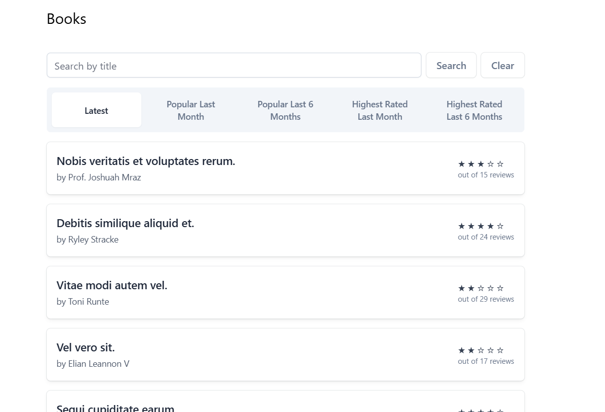
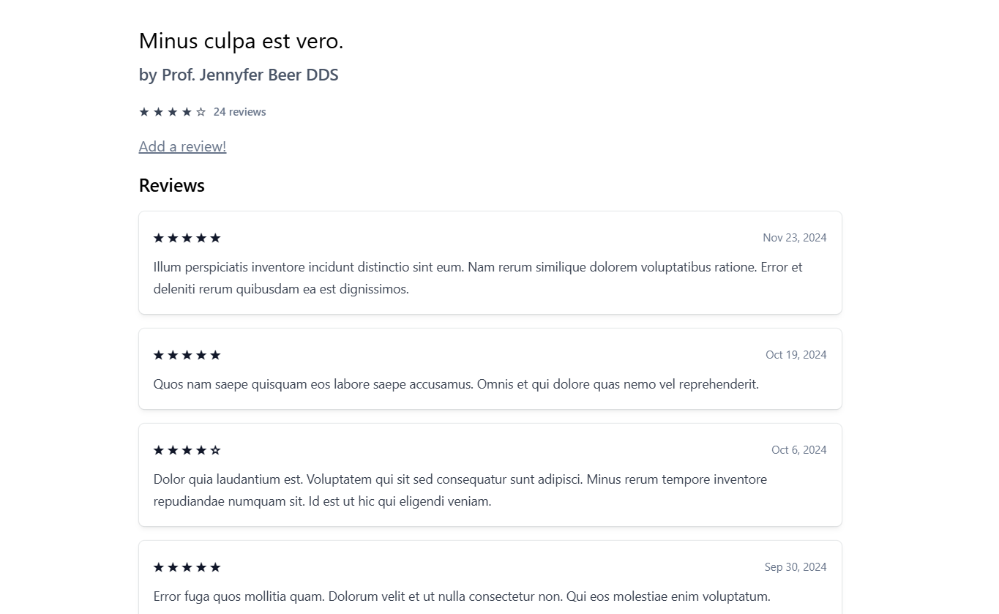
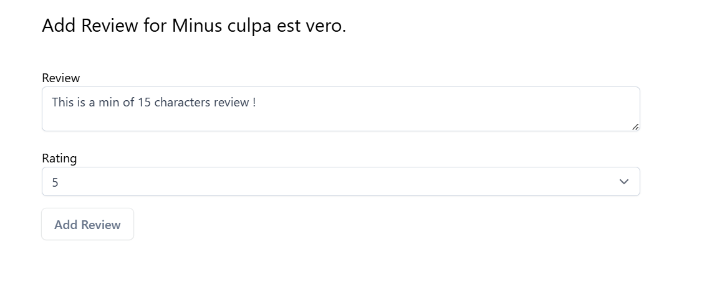
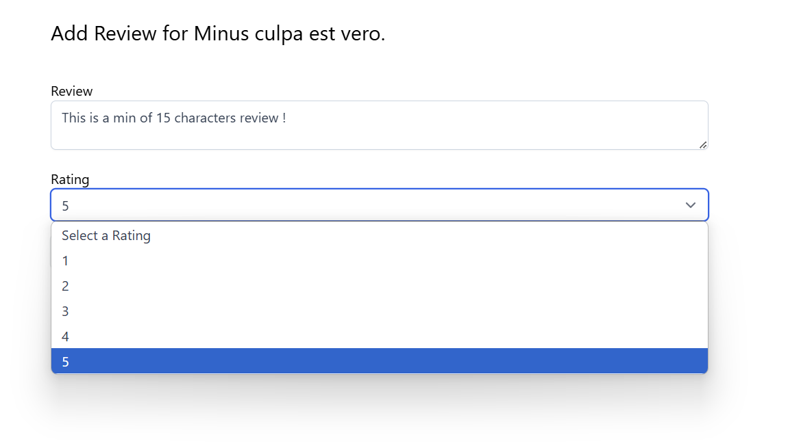
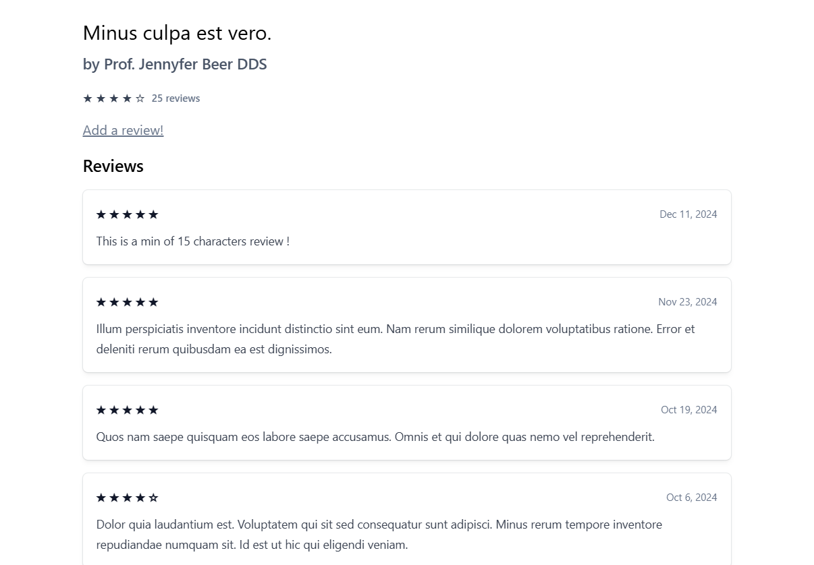
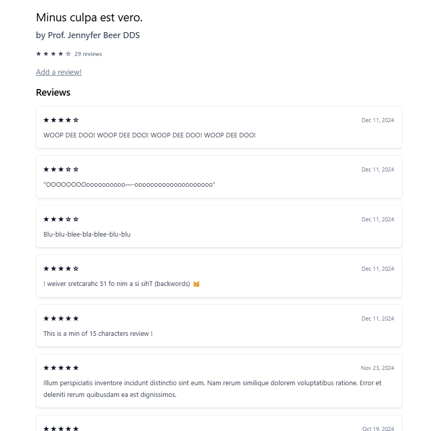
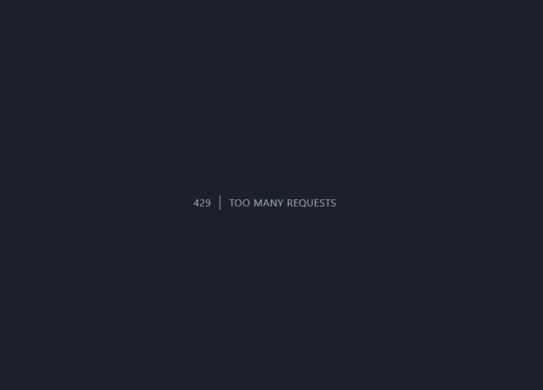

# **Lucru Individual**

## **Prezentare generală**

Am dezvoltat o mică aplicație concepută pentru a gestiona o colecție de cărți și recenziile acestora. Oferă utilizatorilor funcționalități pentru a vizualiza și filtra cărți dupa rating, precum și pentru a crea și adăuga recenzii pentru oricare dintre cărțile listate. Aplicația demonstrează implementarea unei relații unu-la-multe între cărți și recenziile lor, folosind funcții moderne Laravel, cum ar fi componentele Blade, interogarea în cache și limitarea ratei.

Aplicația este dezvoltată utilizând **Laravel 11** ca backend pentru gestionarea logicii aplicației și interacțiunea cu baza de date, iar **Blade** este utilizat ca frontend pentru generarea paginilor dinamice. Această arhitectură permite separarea clară a responsabilităților între backend și frontend, asigurând în același timp un flux de lucru eficient și modern.

## **Funcții principale**

-   Vizualizare lista de cărți.
-   Afișarea detaliilor unei cărți, inclusiv recenziile acesteia.
-   Adăugare recenzii, cu ratinguri între 1 și 5 stele.
-   Filtrare cărți după titlu și categorii populare.
-   Sistem de caching pentru performanță.
-   Limitarea recenziilor la un număr rezonabil pe utilizator (rate limiting).

## **Instrucțiuni de instalare și pornire**

Pentru a instala si porni proiectul trebuie să se cloneze proiectul și să se acceseze directorul, să se instaleze dependențele necesare folosind comanda `composer install` și `npm install`, apoi să se configureze baza de date `MySQL` în fișierul `.env`. Este important ca local sa fie instalat PHP 8.1 sau o versiune mai mare, deoarece proiectul este dezvoltat pe `Laravel 11`. După aceea, trebuie să se ruleze migrațiile și seed-urile cu comanda `php artisan migrate --seed`, să se pornească serverul Laravel cu comanda `php artisan serve` și să se acceseze aplicația la `http://127.0.0.1:8000`.

## **Scopul proiectului**

-   Crearea unei platforme online unde utilizatorii pot adăuga recenzii pentru cărți, pot vizualiza detalii despre cărțile preferate.
-   Oferirea unui sistem de filtrare și căutare a cărților pe baza diferitelor criterii (popularitate, rating, etc.).
-   Oferirea unui sistem de rating pentru a ajuta utilizatorii să își exprime opiniile despre fiecare carte.
-   Implementarea unui sistem de caching pentru a îmbunătăți performanța aplicației, în special pentru resursele frecvent accesate, cum ar fi cărțile cele mai populare.

## **Funcții principale**

### Vizualizare și gestionare cărți:

-   Utilizatorii pot vizualiza o listă cu toate cărțile disponibile în aplicație.
-   Cărțile sunt afișate în ordine cronologică, popularitate sau ratinguri.

### Adăugarea recenziilor:

-   Utilizatorii autentificați pot adăuga recenzii pentru cărțile care le-au citit, având opțiunea de a le evalua cu un rating de la 1 la 5 stele.
-   Fiecare recenzie include un text descriptiv și un rating, iar recenziile sunt asociate cărții corespunzătoare.

### Sistem de filtrare și căutare:

-   Căutare după titlu, autor sau cuvinte cheie.
-   Filtrare cărți după: cele mai populare, cele mai bine cotate în ultima lună, cele mai populare în ultimele 6 luni.

### Vizualizarea detaliilor unei cărți:

-   Detalii complete despre o carte: titlu, autor, rating mediu și recenziile utilizatorilor.
-   Fiecare recenzie este vizibilă alături de ratingul și comentariile acestora.

### Rate Limiting și protecție împotriva spam-ului:

-   Limitarea numărului de recenzii pe care un utilizator le poate adăuga într-o oră (maxim 5 recenzii per oră) pentru a preveni spam-ul.
-   Protecție împotriva atacurilor de tip CSRF și XSS.

### Performanță îmbunătățită prin caching:

-   Aplicația utilizează caching pentru a stoca cărțile cele mai populare și cele mai recente recenzii, reducând astfel timpul de încărcare a paginilor și îmbunătățind performanța generală.

## **Exemple de utilizare**

### 1. Lista de cărți

Pagina principală afișează toate cărțile din baza de date, organizate după popularitate (luna trecuta , ultimele 6 luni), dupa review-uri (luna trecuta , ultimele 6 luni), titlu sau cele mai recente adăugate.

Lista de cărți afișată pe pagina principală



#### Fragment de cod Blade:

```php
@foreach($books as $book)
    <x-book-card :book="$book" />
@endforeach
```

### 1. Detalii carte și recenzii

Pagina fiecărei cărți afișează titlul, autorul, recenziile și rating-ul carții . Utilizatorii autentificați pot adăuga recenzii direct din această pagină.

Pagina unei cărți


Pentru a adăuga o recenzie utilizatorul trebuie să acceseze link-ul `Add a review!` și trebuie sa adauge un comentariu de 15 caractere minimun pentru ca review-ul să fie postat și salvat.Aceasta ajută la prevenirea postării de recenzii foarte scurte, care nu oferă informații valoroase altor utilizatori.

#### Fragment de cod :

1.

```php
public function store(Request $request, Book $book)
    {
        $data = $request->validate([
            'review' => 'required|min:15',
            'rating' => 'required|min:1|max:5|integer'
        ]);

        $book->reviews()->create($data);

        // Clear the cache for the book
        cache()->forget('book:' . $book->id);

        return redirect()->route('books.show', $book);
    }
```

2.

```php
@extends('layouts.app')

@section('content')
  <h1 class="mb-10 text-2xl">Add Review for {{ $book->title }}</h1>

  <form method="POST" action="{{ route('books.reviews.store', $book) }}">
    @csrf
    <label for="review">Review</label>
    <textarea name="review" id="review" required class="input mb-4"></textarea>

    <label for="rating">Rating</label>

    <select name="rating" id="rating" class="input mb-4" required>
      <option value="">Select a Rating</option>
      @for ($i = 1; $i <= 5; $i++)
        <option value="{{ $i }}">{{ $i }}</option>
      @endfor
    </select>

    <button type="submit" class="btn">Add Review</button>
  </form>
@endsection
```

Formularul de recenzie și lista de recenzii.





Dupa apasarea butonului **Add Review** utilizatorul este redirecționat înapoi la pagina cărții pentru a viziona rating-ul recent adăugat de acesta.



Review-ul este afișat pe pagina cărții impreună cu ratig-ul si data la care a fost creat.

N.B : În Laravel 11, folderul `middleware` nu mai este inclus implicit, deoarece framework-ul a fost optimizat pentru a gestiona middleware-urile și configurările direct în fișierele de provider, cum ar fi `AppServiceProvider`, aici și am inclus:

```php
public function boot(): void
    {
        RateLimiter::for('reviews', function (Request $request) {
            return Limit::perHour(5)->by(
                $request->user()?->id ?: $request->ip() // Check user ID or fallback to IP
            );
        });
    }
```

Pentru limitarea recenziilor la 5 pe oră pe utilizator (rate limiting), pentru a preveni abuzurile și spam-ul, asigurându-se că recenziile sunt postate într-un ritm natural și relevant. Această abordare protejează aplicația de atacuri automate.



Dacă se încercă să se mai adauge un review :



## **Lista surselor utilizate**

-   [Documentația Laravel 11](https://laravel.com/docs)
-   [Documentația PHP](https://www.php.net/docs.php)
-   [Documentația Tailwind CSS](https://tailwindcss.com/docs)
-   [Documentația MySQL](https://dev.mysql.com/doc/)
-   [Tutoriale și ghiduri StackOverflow](https://stackoverflow.com)
